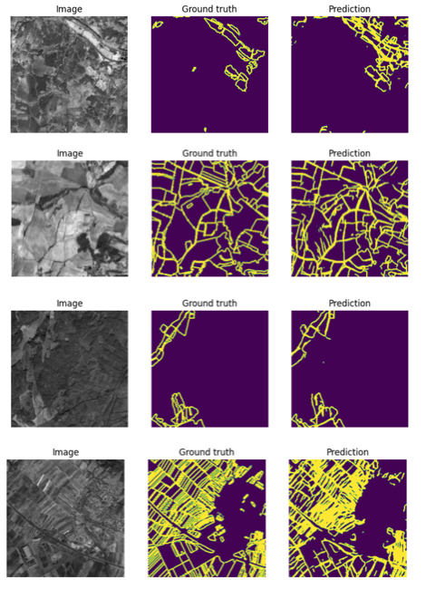
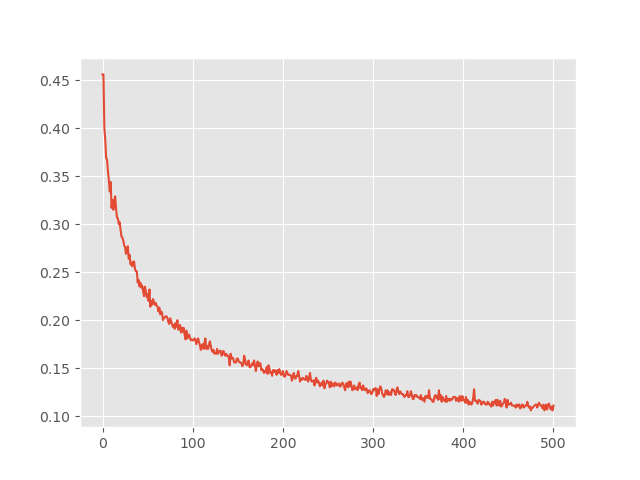
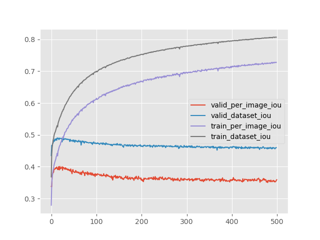

### やりたいこと
- 画像セグメンテーションによるAgricltural parcelの境界の抽出
### 進捗
- AI4 boundariesのSentinelデータとラベルを用いて分類
- 画像入力は256x256 pixel（分解能10mなので2560mx2560m）。チャンネルはB2,B3,B4,B8（それぞれB,G,R,NIR）の４チャネル. .ncファイル形式で提供.
- ラベルはextent, boundary, distanceの3チャネル。結果としてほしいのはboundaryのみ. .tifファイル形式で提供.
- Tensorflowの画像セグメンテーションのチュートリアルに従って学習を実施. segmentatin.ipynbに実装.

### 前処理
- .ncデータおよび.tifデータをnp.array()形式で取得. dtypeをuint8に指定
- 入力を４チャンネルに増やすのが困難だったため、３チャンネルに減らした（B3,B4,B8の３つ）.実際に一番特徴量として聞いてくるのはB8のNIRであるため、B2を削除した影響は軽微であると想定.
- 出力（マスク）はextent, boundary, distanceの３チャンネル. もともとRGBの３チャンネルを想定しているため、出力側は変更する必要がなかった
- この他にチュートリアルではスカラー値のラベル情報（犬がどの種類であるか）が入っている.今回の用途ではこのラベル情報は必要ないため与えていないが、これがうまくいかない原因になっているのかもしれない？そもそもよくわかっていないのが、セマンティックセグメンテーションのセマンティックが、マスクデータの種類（外部、輪郭、内部）のことを意味しているのか、それともラベル（＝犬の種類）を意味しているのかどっちなのか。普通に考えれば後者であるはずだが、チュートリアルのデータセットでラベルを抽出すると、一つの画像に対して一つのラベルしか与えられていないのが気になる。実際はピクセルごとにラベル（そのピクセルが何のアイテムに属するか、犬なのか猫なのか木なのか）を割り当てるのが筋だと思うが、そうなっていはいないようである→さらなる確認の余地あり。

### 学習
- Loss functionを`tf.keras.losses.SparseCategoricalCrossentropy(from_logits=True)`から`tf.keras.losses.CategoricalCrossentropy()`に変更した。こうしないとlabelとlogitsの次元が一致しないというエラーがでる。この変更はたまたまエラーが消えたのでこうしているが、正しい方法であるかはわかっていない。ベーシックな最小２乗平均`mse`も試してみたが、これだと動かなかった.
- 学習させた結果はうまく動いていない. 学習曲線を確認すると、学習が途中でサチっているか、そもそもLoss functionの値が計算されずにNANを返している。

### その他の問題点
- データセットをnumpy.arrayからtensorに変換するのが遅すぎる. データセットを作る際に、Sentinelの画像をオンメモリにいったん全てロードしているが、これは明らかにまずいやり方に思える. 100くらいだとすぐ終わるが、5000以上の訓練データがあるので、スタックしてしまう。実際、5000のデータを全て使うのは無理で、1000くらいが限度だった. 画像データを全て使えていないことから、正しいやり方ではないことがわかる.

### Pytorchを試す→動いた
- Pytorchのライブラリ(https://github.com/qubvel/segmentation_models.pytorch#models)を使ったら動いた
- 衛星画像をfloat64からuint8に変換するところに注意。入力は以前として３チャンネルにしている。
- 各種ネットワークを１エポックだけ回して比較してみたところ、ベストがUnet、次点がFPNという結果だった。IOUが30%代なので実用にはまだ遠い。Data augmentationをする必要があるか？精度が倍にはならない気がするので、Fractal_ResUNetのような、衛星画像のDelineationに特化したモデルを使う必要がありそう。不思議なのは、他の論文ではUnetがかなり良い（＝実用的な）性能を叩き出していたこと。自分の実装と何が違うんだろう？

### U-Netの学習曲線
- 結果としてはまあまあ学習しているように見える

- 以下の２つの学習曲線からもわかるように過学習を起こしている

